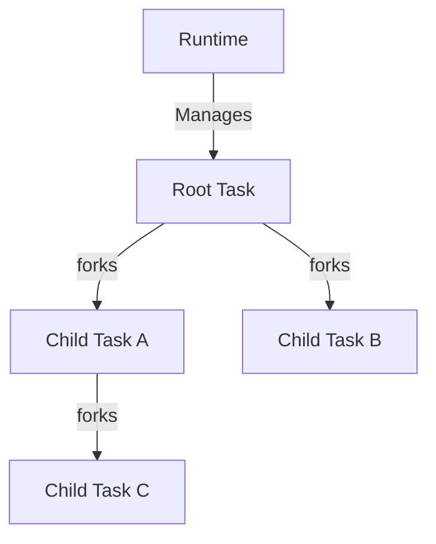
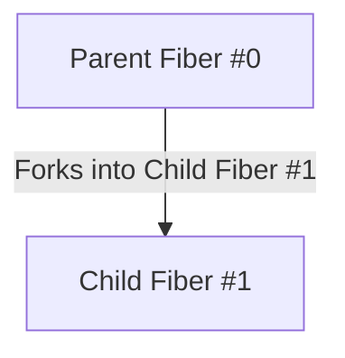
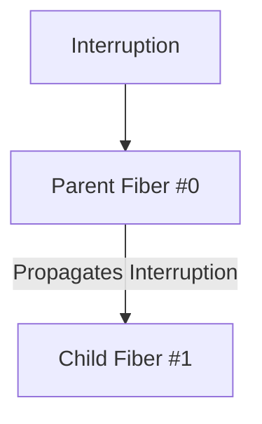
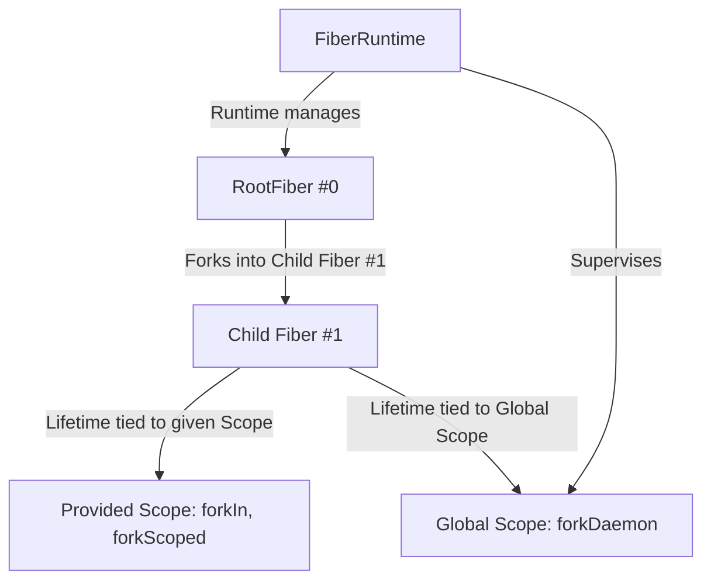
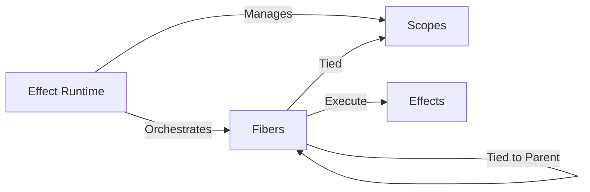

---
# try also 'default' to start simple
theme: dracula
# random image from a curated Unsplash collection by Anthony
# like them? see https://unsplash.com/collections/94734566/slidev
# apply any windi css classes to the current slide
class: 'text-center'
# https://sli.dev/custom/highlighters.html
highlighter: shiki
# show line numbers in code blocks
lineNumbers: false
# some information about the slides, markdown enabled
info: |
  ## Antoine Coulon, Effect Days #2
  
  Structured Concurrency, the hidden power behind Effect
# persist drawings in exports and build
drawings:
  persist: false
# use UnoCSS (experimental)
css: unocss
---

## Structured Concurrency, the hidden power behind Effect

<br>
<br>

**Antoine Coulon** @ **Effect Days** #2

---

<div class="grid grid-cols-10 gap-x-4 pt-5 pr-10 pl-10">

<div class="col-start-1 col-span-7 grid grid-cols-[3fr,2fr] mr-10">
  <div class="pb-4">
    <h1><b>Antoine Coulon</b></h1>
    <div class="leading-8 mt-8 flex flex-col">
      <p class="mt-3">Freelance Lead Software Engineer</p>
      <p class="mt-3">Author <b color="orange">skott, effect-introduction</b></p>
      <p class="mt-3">Advocate <b color="orange">Effect</b></p>
      <p class="mt-3">Contributor <b color="orange">Rush.js, NodeSecure</b></p>
    </div>  
  </div>
  <div class="border-l border-gray-400 border-opacity-25 !all:leading-12 !all:list-none my-auto">
  </div>

</div>

<div class="pl-20 col-start-8 col-span-10">
  

  <div class="mt-5">
    <div class="mb-4 flex justify-between"><ri-github-line color="blue"/> <b color="opacity-30 ml-2">antoine-coulon</b></div>
    <div class="mb-4 flex justify-between"><ri-twitter-line color="blue"/> <b color="opacity-30 ml-2">c9antoine</b></div>
    <div class="mb-4 flex justify-between"><ri-user-3-line color="blue"/> <b color="opacity-30 ml-2">dev.to/antoinecoulon</b></div>
  </div>
</div>

</div>

<style>
  h1 {
    color: #4c7fff;
  }
  img {
    margin: 0 auto;
  }
</style>

---

## Implementing the right Concurrency model is hard

> "Concurrency is about dealing with a lot of things at once" (Rob Pike)

- Providing efficient concurrency, avoiding starvation and resource leaks 
- Offering cancellation with proper finalization mechanisms
- Dealing with errors
- Avoiding orphan tasks/threads/processes

<div v-click>

  <div class="grid grid-cols-2 gap-x-4 pt-1">
    
  <div class="pt-15">
    <b>The Event-Loop solves many concurrency issues, but some are still left</b>
  </div>

  <div class="flex justify-center">
    
  </div>

  </div>

</div>

---

## The JavaScript async/await problem

> Leaking resources is too easy

<br>

<div class="grid grid-cols-2 gap-x-2 pt-1">

  <div>

```ts {1|4|all|4}
async function acquireUseRelease(work) {
  let resource = await acquire();
  try {
    await work(resource);
  } finally {
    release(resource);
  }
}
```

<div v-click class="pt-5 flex justify-center">
  <div>
  What if a Promise never settles? It's leaked forever

  <ul class="pt-5">
    <li>We don't have any handle on that Promise</li>
    <li>Event-loop will be kept alive</li>
    <li>Resource won't be released</li>
  </ul>
  </div>
  </div>

  </div>


  <div v-click class="flex justify-center">
    
  </div>


</div>


---

## Do we have builtin solutions for that?


<div class="grid grid-cols-2 gap-x-4 pt-3">

  <div v-click>

    Explicit resource management (stage 3)

```ts
export async function acquireUseRelease(resource) {
  using resource = await acquire();
  await work(resource);
}
```

→ We are still bound to `work()` lifetime
<br><br>
→ More or less syntactic sugar over `try/finally`


  </div>

  <div v-click>

    Abort Controller API

```ts
async function acquireUseRelease(work, signal) {
  let resource = await acquire(signal);
  try {
    await work(resource, signal);
  } finally {
    release(resource);
  }
}
```

→ Good if the signal is correctly managed and drilled down
<br>
<br>
→ Firing the signal is a request, **not a guaranteed cancellation**


  </div>

</div>

---

## The real solution: Structured Concurrency

> A hierarchical model following the path of an operating system

<div class="grid grid-cols-2 gap-x-4 pt-1">

  <div>
  <p>🔗 Resource Management: children are tied to a parent scope, ensuring automatic cleanup.</p>
  
  <p class="pt-4">⏳ Bound lifetime: by default, a child can not outlive its parent lifetime.</p>
  
  <p class="pt-4"> ❌ Cancellation & Propagation: When a parent task is cancelled, all children are cancelled automatically.</p>
  </div>

  <div class="text-center">



  </div>

</div>

---

## Structured Concurrency with Effect

> Hold my Automatic Supervision... you don't even need to think about it


<div class="grid grid-cols-2 gap-x-4 pt-1">

<div v-click>

```ts
import { Console, Duration, Effect, pipe } from "effect";

const fetchUserId = (id: number) =>
  pipe(
    Effect.async((resolve) => {
      console.log(`Start fetching ${id}`);

      const timeout = setTimeout(() => {
        resolve(Effect.succeed(`User ${id}`));
      }, 1000 * id);

      return Effect.sync(() => clearTimeout(timeout));
    }),
    Effect.onInterrupt(() => 
      Console.log(`Fetch User#${id} interrupted`)
    )
  );
```


</div>

<div v-click>

```ts
const interruptProgram = Effect.interrupt.pipe(
  Effect.delay(Duration.seconds(2))
);

const program = pipe(
  Effect.all(
    [ fetchUserId(1), fetchUserId(2), fetchUserId(3) ], 
    { concurrency: "unbounded" }
  ),
  Effect.zip(interruptProgram, {
    concurrent: true,
  })
).pipe(Effect.runFork);
```

```bash
$ Start fetching 1
$ Start fetching 2
$ Start fetching 3
$ User#1 fetched
$ User#2 fetching interrupted
$ User#3 fetching interrupted
```

</div>


</div>

---

## 👨‍👧‍👧 Automatic Supervision

> The child fiber is automatically supervised by the parent fiber

<div class="grid grid-cols-2 gap-x-4 pt-1">

<div v-click>

`Effect.fork`: child is tied to the parent lifetime

```ts
const background = pipe(
  Effect.log("background"),
  Effect.repeat(Schedule.spaced("5 second"))
);

const foreground = pipe(
  Effect.log("foreground"),
  Effect.repeat({ 
    times: 2, 
    schedule: Schedule.spaced("1 second") 
  })
);

const program = Effect.gen(function* () {
  yield* Effect.fork(background);
  yield* foreground.pipe(
    Effect.onExit(() => Effect.log("Bye"))
  );
});
```

</div>

<div v-click class="pt-5 text-center">

<div class="grid grid-cols-2 gap-x-4 pt-1">

<div>

</div>

<div>

</div>


</div>

```bash
level=INFO fiber=#0 message=foreground
level=INFO fiber=#1 message=background
level=INFO fiber=#0 message=foreground
level=INFO fiber=#0 message=foreground
level=INFO fiber=#0 message=Bye
```

</div>

</div>

---

## 💨🏃‍➡️ Escaping the Parent Supervision

> Forking Tasks detached from Parent Task lifetime using Scopes

<div class="grid grid-cols-2 gap-x-4 pt-1">

<div>
  <div>

  ```ts {all|14-15} {lines:true}
  const program = Effect.gen(function* () {
    yield* Effect.forkDaemon(background);
  });
  ```
  </div>
  
  <div class="pt-5">

  ```ts {all|14-15} {lines:true}
  const program = Effect.gen(function* () {
      // ^ Effect.Effect<void, never, Scope>
    yield* Effect.forkScoped(background)
  });
  ```
  </div>

  <div class="pt-5">

  ```ts {all|1,3} {lines:true}
  const program = (scope: Scope.Scope) =>
    Effect.gen(function* () {
      yield* Effect.forkIn(scope)(background);
    });
  ```
  </div>

  
</div>

<div v-click class="pt-5 text-center">



</div>

</div>

---

## Fiber: the Effect primitive empowering Structured Concurrency

> A Fiber is a convenient primitive in the context of Structured Concurrency

<br>

- Lightweight: similar a virtual/green thread, minimal overhead and low handling cost.
- Non-blocking: cooperative multitasking to maximize concurrency.
- Scoped: belongs to a structured scope, ensuring proper lifecycle management.
- Stateful: can be started, suspended, resumed, or interrupted.


<div class="text-center pt-5">

</div>

---

## Thanks for listening!


<div class="pb-4">
    <ul class="leading-8 mt-8 flex flex-col">
    <li><b>Effect Fibers</b>: <b color="cyan">https://effect.website/docs/concurrency/fibers/</b></li>
    <li><b>ZIO Structured Concurrency</b>: <b color="cyan">https://zio.dev/reference/fiber/#structured-concurrency</b></li>
    <li><b>Kotlin Structured Concurrency</b>: <b color="cyan">https://kotlinlang.org/docs/coroutines-basics.html#structured-concurrency</b></li>
    </ul>
  </div>


<div class="flex justify-center mt-7">
  
  
</div>


